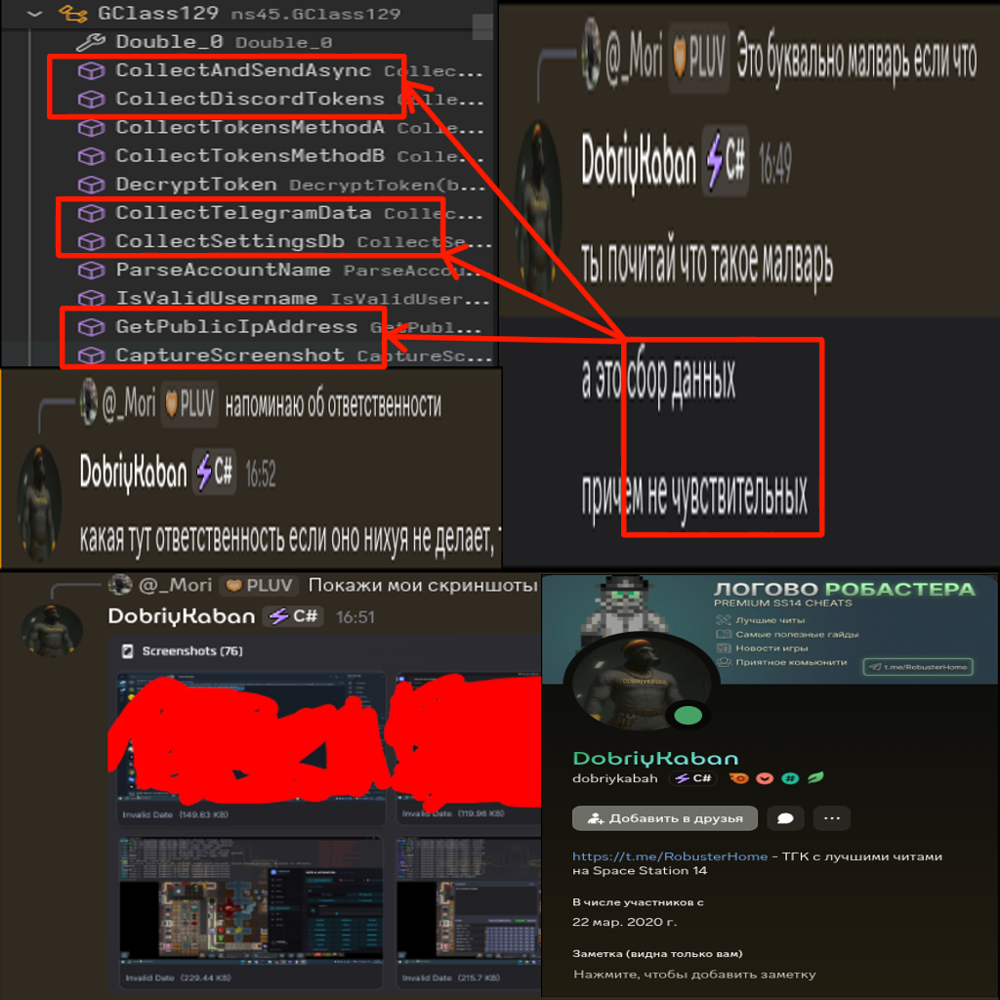
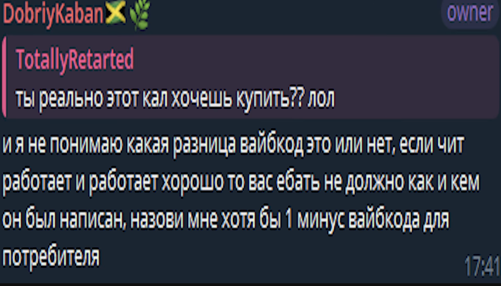

# GEMINI.CC (kaban.cc) decomp

  
  

A vibecoded RAT (cheat/Telemetry folder) masquerading as an SS14 cheat, sold for 150 RUB a week by a shkolnik who can't help to not get ratted himself.

This is not a *crack*, this is a decomp and organise for research and *thanking for inspiration*.

Comes in two parts: `cheat` (self-explanatory), and `payload`, which holds the actual resources used by the cheat.

If you wanna fuck with it [CRACKING.md](CRACKING.md) is a todo-list on how to disable telemtry and anti-tamper.

## IT'S A FUCKING RAT:

Everything below is sent in the clear to a Russian VPS at `http://31.177.83.245:3001`.

| What gets exfiltrated | How | Where it goes |
| --- | --- | --- |
| Desktop screenshots | `Telemetry/UserDataCollector.cs:CaptureScreenshot` + `Telemetry/TelemetryCollector.cs:SendScreenshotAsync` | `POST /api/v1/telemetry/screenshot` |
| Your public IP | `Telemetry/UserDataCollector.cs:108` `new HttpClient()` GET to `api.ipify.org` (fallback `icanhazip.com`) | bundled into `/api/v1/telemetry/upload-collected` |
| HWID | `Auth/HwidProvider.cs:GetCPUIDInfo` + registry `MachineGuid` | `/api/v1/auth/validate-license` |
| Whole sysinfo dump | `Telemetry/UserDataCollector.cs` zips `%TEMP%/kaban_collect_{guid}/` | `/api/v1/telemetry/upload-collected` |
| Performance + event metrics | `Telemetry/TelemetryQueue.cs` batched JSON, AES'd | `/api/v1/telemetry/event` |
| Startup ping | `Bootstrap/BootstrapHooks.cs:SendStartupScreenshotAsync` | `/api/v1/telemetry/startup` |
| "Security events" (you running a debugger, you booting in a VM, you having Process Explorer open) | `AntiCheat/ProtectionSequence.cs` + `Telemetry/TelemetryHttpClient.cs` | `/api/v1/security/event` |
| Anything the operator asks for | `Telemetry/DiscordRelayClient.cs:HandleScreenshotCommand` / `HandleDataCollectionCommand` | Discord gateway |

You don't need to be a server admin to get owned by this. You just need to buy it.

Previously this had methods to take your settings.db, telegram desktop tdata and discord tokens. The claim by the shkolnik responsible for this fiasco claims a different developer has inserted the methods in the cheat and on server. The methods have been removed in this release in case someone mentally deficient decides to run this slop on their machine either way.

## ORGANISATION:

`cheat/` is split into 29 freshly-renamed category folders (formerly 229 `nsN/` namespaces and 124 obfuscated root `Class*`/`GClass*` files). Pre-existing `CerberusWareV3.*`, `AutoChemMod`, `Kaban.cc.Core.Security.AntiCrack`, `Properties`, `System.Runtime.CompilerServices` are left (almost) as-is.

| Folder | Files | Contents |
| --- | ---:| --- |
| `Bootstrap/` | 6 | Entry hooks, embedded native loader, render hook (`WglSwapBuffersHook`, MinHook), Win32/OpenGL imports |
| `WebControlPanel/` | 8 | WebSocket+HTTP control server, WebView2 menu, WinForms wrapper, HMAC msg validator |
| `Configuration/` | 12 | `CerberusConfig` (5,692 lines) + parallel DTO mirror `CerberusConfigData` (15,744 lines) + 3 different serializers + auto-saver |
| `Auth/` | 15 | License/JWT/HWID/watermark/endpoint/version/connectivity validators (5 redundant token layers) |
| `Telemetry/` | 10 | Telemetry HTTP/queue/batch, Discord C2 relay, screenshot collector, public-IP exfil |
| `AntiCheat/` | 43 | Anti-debug/dump/VM/tamper, PE-header eraser, hook detection, kernel/registry checks, callstack scrubbing, blacklists |
| `Crypto/` | 1 | AES string crypto |
| `Bruteforce/` | 7 | Nuke disk + uplink PDA-ringer bruteforce engines + UI patches |
| `AutoBuy/` | 5 | Antag store autobuy with hand-rolled JSON |
| `GhostRole/` | 3 | Ghost-role auto-take + UI patch + console command |
| `AutoChem/` | 7 | Recipe loader/cooker, dispenser & chem-master patches, autochem command |
| `AutoFeatures/` | 14 | AutoCuff, AutoStrip, AutoGrab, AutoHypo, AutoMedipen, AutoHackDoors, AutoOpenDoors, AutoStop, AutoDeconstruct, AutoImplants, AutoJumpDash, AutoPickupOverlay, MeleeMacroPlayer, FuckRulesCommand |
| `AimBot/` | 22 | Path/gun/damageable helpers, target selectors, melee/throw aimbots, projectile predictor, mouse rotator |
| `AntiAim/` | 3 | Strafe/circle anti-aim + auto lay-down |
| `Movement/` | 11 | PixelSurf, ShieldSurf, AutoStrafe, AutoPath, ZoomController, position backtracker |
| `Visuals/` | 47 | All ESP overlays, shader-draw helpers, shader replacement patch, render-system patches, render optimiser, hitbox selector |
| `Hud/` | 9 | HUD renderer, notifications, entity inspector, overlay registry |
| `Combat/` | 11 | Antag/contraband detection, friends & priority lists, melee patches, chat spammer, trash-talk system |
| `Network/` | 17 | Packet & event logger/editor/spammer, network-message patches |
| `Lua/` | 10 | Lua script manager + ImGui UI element wrappers |
| `Crayon/` | 4 | Crayon image-to-decal drawer, parser, UI patch |
| `Localization/` | 6 | i18n + Google Translate (via someone's free PythonAnywhere account) + chat translate patch |
| `Macros/` | 2 | Macro action / Macro DTOs |
| `Performance/` | 1 | Hardware unlocker sets process+GPU priority high |
| `Resources/` | 5 | Texture/sound/font/image managers, sprite render queue |
| `Patches/` | 30 | Generic Harmony patches that don't fit a feature folder |
| `Stubs/` | 4 | Empty obfuscator-residue helper classes shipped to prod |
| `Obfuscation/` | 33 | Eazfuscator decoy chain, resource decoder (8,554 `smethod_*`), junk attributes |
| `Misc/` | 7 | Logger, ColorPalette, ColoredString, NumericValue, KeyStateHelper, two `PlayerComponentHelper`s |

GREATEST HITS:
* Windows-only due to heavy DllImport use.
* Anticheat/AntiTamperWatchlists looking for other cheats
* Configuration/CerberusConfigData тут просто fuck your mother. 15744 lines of config with a DTO mirror in CerberusConfig.
* AntiCheat/PeHeaderEraser erasing its headers when Misc/Logger.cs announces itself to the debugger like a rape victim.
* AutoBuy/AntagAutoBuyEngine.cs:EscapeJson rolling json by hand while Escape.Text.Json is already imported.
* Combat/AntagDetectorSystem.cs using eleven nearly identical methods for eleven antags. Traitor detection method doesnt even fucking work anymore.
* Bootstrap/EazfuscatorResourceDecoder.cs - lol
* Obfuscation/ObfChain00..ObfChain27.cs - doubly lol
* Localization/GoogleTranslateClient.cs uses **pythonanywhere** for translation. TRANSLATION IS DONE BY PROXY THROUGH A FREE PYTHONANYWHERE ACCOUNT
* Performance/HardwareUnlocker.cs how to get 5 fps 2026 new method
* WebControlPanel/WebControlServer.cs you are now a part of the botnet, and you will be driven from a webpage. Also you can do http://localhost but like whatever
* WebControlPanel/WebMessageValidator.cs handrolled hmac with constanttimeequals, AND THE LICENSE SERVER IS PLAIN HTTP, ***WHATS YOUR THREAT MODEL HERE???***
* Auth/JwtTokenValidator.cs + Auth/WatermarkValidator.cs + Auth/RuntimeTokenVerifier.cs + Auth/EndpointValidator.cs + Auth/EndpointValidationSummary.cs redundant with the above point.
* `Visuals/ShaderReplacementPatch.cs` patches `ResourceManager:ContentFileRead` and overrides 14 .swsl files (`Bloom`, `ChamsRainbow`, `ChamsPulse`, `ChamsMetallic`, `ChamsWireframe`, `ChamsGlow`, `ChamsFlat`, `ChamsGalaxy`, `ColorFilter`, `MotionBlur`, `CerberusSpirit`, `ScreenDistortion`, `SmoothCircle`, `ChromaticAberration`, `Tracer`) with russian-commented GLSL. VFS is too difficult.
* Telemetry/UserDataCollector.cs:108 `new HttpClient()` GET to `api.ipify.org` to grab your public IP
* Visuals/SpiritsOverlay.cs:129 loads `targetesp.fuckfinger.png`.
* Configuration/CerberusConfig.cs:1606 chat spammer defaults to `https://t.me/RobusterHome`
* Patches/ShowRulesPatch.cs:ShowRulesPrefix exposes AutoFuckRulesMode 0/1/2. only mode 1 has code. Also it trips admin alerts because fuckrules now informs the server that you've done so.
* AntiCheat/AnticheatCallStackPatch2.cs:94 scrubs "aimbot", "esp", "cerberus", "marsey", "moony" out of stack traces before they leave the client. the cheat can't *not* be in the stack so it pretends it isn't.
* Bootstrap/BootstrapHooks.cs:1021 fully-localised RUSSIAN MessageBox for "WebView2 not installed". the install-failure path is more polished than the threat model.
* Misc/PlayerComponentHelper.cs and Misc/PlayerComponentHelper2.cs are the same class.
* Stubs/StubHelper1..4 is just "nasral" and nothing else.
* Combat/ChatSpammer.cs:89 `GenerateProtectWord` adds 6 random chars so server dedup doesn't eat your spam.
* AutoChem/ChemMasterUiPatch.cs:88 hardcodes Harmony id `"kaban.autochem.chemmaster"`. anti-cheat scanning Harmony instances picks this up instantly.
* Auth/HostAvailabilityChecker.cs:CheckHostOrExitAsync — if `31.177.83.245:3001` is down, every paying user's game exits. one IP. no DNS. no fallback.
* Bootstrap/EazfuscatorResourceDecoder.cs:smethod_0 ends with `LocalizationStringTools.smethod_1("Хитролох_иди_нахуй._46__4_____32_____")`.
* Configuration/AntiCheatConfig.cs exposes EnableAntiDebug / EnableAntiVM / EnableAntiDump / EnableHooksDetection / EnableProcessHiding as menu booleans. user can opt out of the cheat's own anti-cheat layer.
* AntiCheat/CheatEngineKiller.cs:DetectAndKillCheatEngine that is worked around by a modified cheat engine
* Configuration/CerberusConfig.cs:ProjectileEsp.AutoDodge can and will get you spaced
* AutoChem/AutoChemRecipeManager.cs:GetRecipesDirectory checks `<asm-dir>/chem`, then `%AppData%/kaban.cc/chem`, then `<cwd>/chem`.
* AutoChem/AutoChemCooker.cs is static-everything — `static HashSet<ReagentDispenserBoundUserInterface>`, `static Dictionary` for every cache. and every `RegisterInterface` call Logger.Info's `[AutoChem] Tracking new Dispenser UI. Total: N` so any attached debugger watches you cheat chem in real time.
* AutoChem/AutoChemRecipeManager.cs:CreateExampleRecipe writes an example file to disk on first run before the user has touched anything. file IO as a hello-world.

Lua:
* Lua/LuaScriptRunner.cs:182 `lua_0.DoString(value, "chunk")` — NLua with no sandbox. os.execute, io.open, require, import all work. line 238 hands the script the live `Harmony` instance (`lua_0["Harmony"] = harmony_0`). a single .lua file dropped in `%AppData%/Kaban.cc/Lua/` can patch any method in the process. you bought a cheat that runs other people's cheats.
* Lua/LuaScriptManager.cs:LoadScripts reads `*.lua` AND `*.zip` from that folder, unpacks zips, runs them. no signature, no manifest, no allowlist. drag-and-drop RCE for whoever ships the popular "kaban mod".
* Lua/LuaScriptRunner.cs:167 hardcodes Harmony id `"kaban.lua." + Name`.
* Lua/LuaUiCheckbox/Slider/Button/ComboBox/ColorPicker/TextInput/Label — six dedicated DTO classes for lua-side GUI elements. a dictionary would have done it.

Signing keys:

every "secret" in this here is a UTF-8 string literal.

| What | Where | Value | What it "protects" |
| --- | --- | --- | --- |
| AES key + IV | `Crypto/AesStringCrypto.cs:10-11` | `"KabanSecurityKey2024!@#$%^&*()[]"` / `"KabanIV123456789"` | every "encrypted" string. CBC with reused IV — known-plaintext leak by design. |
| HMACSHA256 secret | `Auth/RuntimeTokenVerifier.cs:190` | `"KabanDropper_To_Patch_Secret_2024_v1"` | dropper→patch token. signed with a key that ships inside the patch. |
| HMACSHA256 secret | `Auth/WatermarkValidator.cs:169` | `"KabanCC_Launcher_Secret_2024_v3"` | launcher watermark. `_v3` = rotated at least three times, each in cleartext. |
| Rijndael key + IV | `Obfuscation/EazfuscatorResourceDecoder.cs:51436-51437` | `SHA256(BitConverter.GetBytes(10))` / `new byte[16]` | the 33 MB `Хитролох_иди_нахуй._________72_8_6__5_` resource blob. one integer literal. all-zero IV. |
